

<h1>On-premises Active Directory Deployed in the Cloud (Azure)</h1>
This tutorial outlines the implementation of on-premises Active Directory within Azure Virtual Machines. 

<h2>Environments and Technologies Used</h2>

- Microsoft Azure
- Windows Server 2025
- Windows 10
- Active Directory Domain Services (AD DS)
- DNS
- Remote Desktop Protocol (RDP)
- Windows Event Viewer
- PowerShell
- Azure Virtual Network

<h2>Operating Systems Used </h2>

- Windows Server 2025
- Windows 10 (21H2)

  <h2>Project Objectives</h2>

- Deploy a Windows Server 2022 Domain Controller in Microsoft Azure
- Configure networking, DNS, and virtual machine connectivity
- Install and configure Active Directory Domain Services (AD DS)
- Create and manage an Active Directory domain environment
- Join a Windows 10 client machine to the domain
- Create and manage administrative and standard user accounts
- Configure Organizational Units (OUs) for resource organization
- Troubleshoot user authentication and account lockout issues
- Enable and disable user accounts as part of identity management processes
- Monitor system and security logs using Event Viewer
- Validate domain authentication, DNS resolution, and client connectivity
- Gain hands-on experience with enterprise identity and access management concepts

<h2>High-Level Deployment and Configuration Steps</h2>

- Create Azure Resource Group and Virtual Network
- Deploy Windows Server and Windows 10 Virtual Machines
- Configure the Domain Controller and install Active Directory Domain Services
- Join the Client Computer to the Domain and verify connectivity

<h2>Deployment and Configuration Steps</h2>

**Step 1: Create Azure Resource Group and Virtual Network**

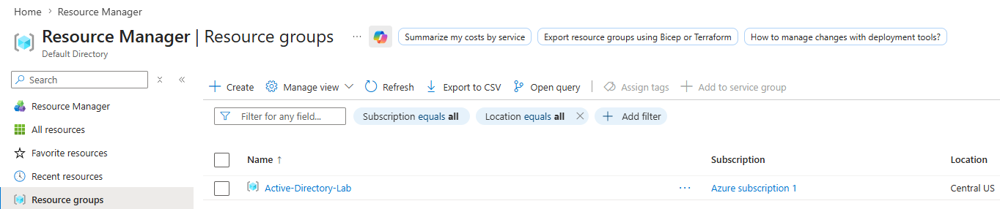

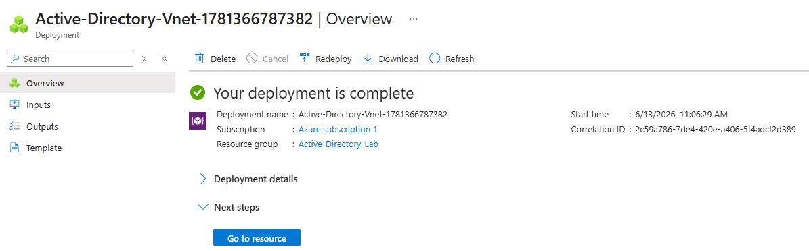

  
- What was done:
Created a Resource Group and Virtual Network in Azure to host all resources required for the Active Directory environment.
  
- Why it matters:
The Virtual Network provides secure communication between virtual machines, while the Resource Group helps organize and manage cloud resources efficiently.

 

**Step 2: Create the Domain Controller VM (DC-1)**

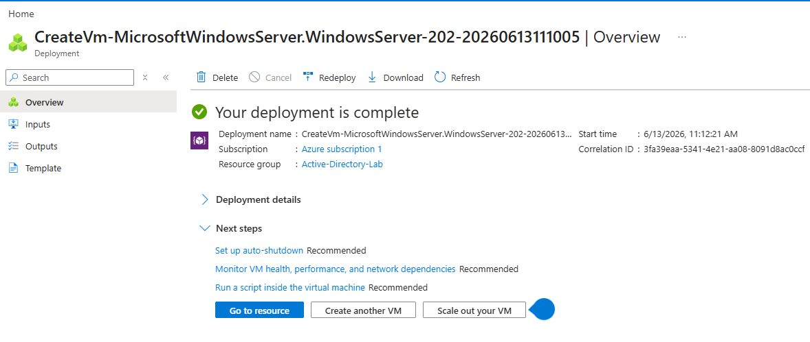

  
- What was done:
Deployed a Windows Server 2022 virtual machine and configured a static private IP address to serve as the Domain Controller.

- Why it matters:
A Domain Controller provides centralized authentication, authorization, and directory services. A static IP address ensures clients can consistently locate domain and DNS services.

 

**Step 3: Create the Client VM (Client-1)**

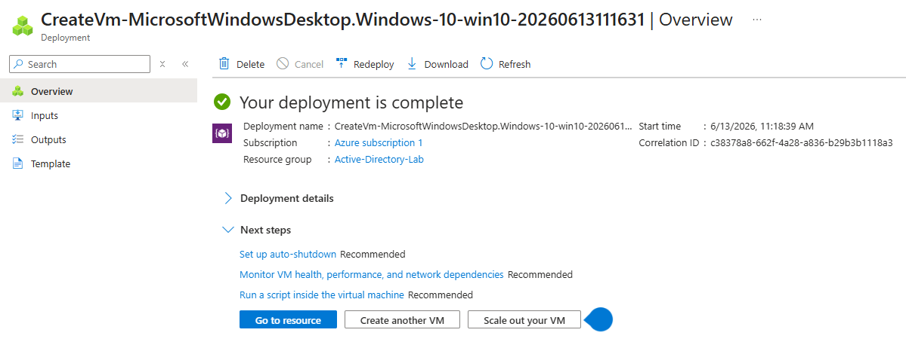

  
- What was done:
Deployed a Windows 10 virtual machine within the same Virtual Network as the Domain Controller.

- Why it matters:
This machine simulates a workstation in a corporate environment and will later be joined to the Active Directory domain for centralized management.

 

**Step 4: Set DC-1 NIC Private address to be static**

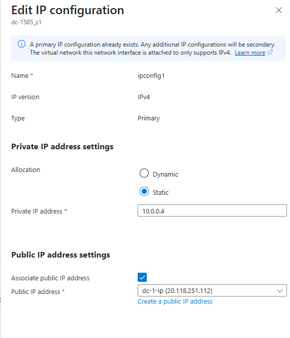

  
- What was done:
The Network Interface Card (NIC) of the Domain Controller (DC-1) was configured with a static private IP address within Azure. This ensures that the server always uses the same internal network address.

- Why it matters:
Domain Controllers provide critical services such as Active Directory and DNS. If the server's IP address changes, client computers may be unable to locate the Domain Controller, causing authentication, DNS resolution, and domain-related services to fail. Assigning a static IP address ensures reliable communication and consistent access to network services throughout the environment.

 

**Step 5: Disable DC-1  windows Firewall**

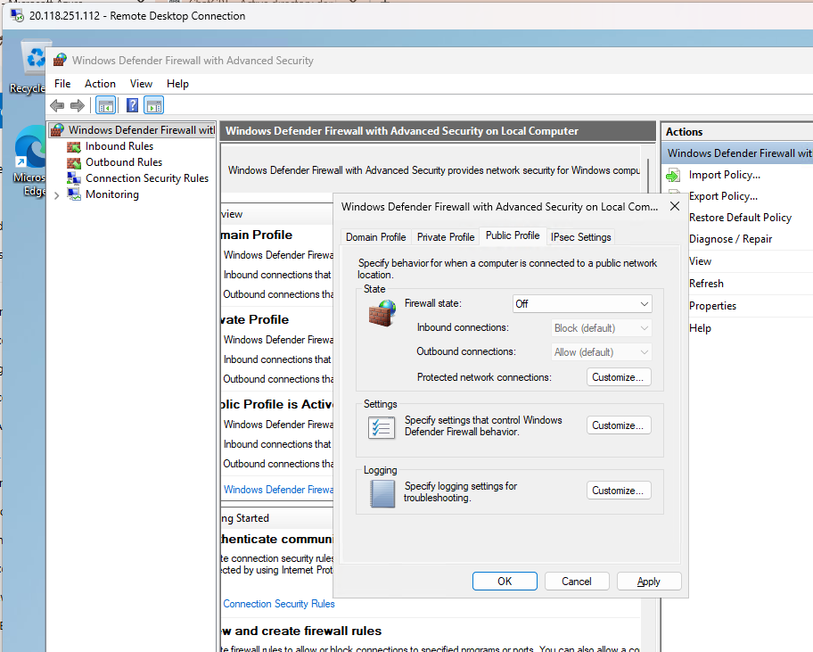

  
- What was done:
Logged into the Domain Controller (DC-1) and temporarily disabled the Windows Defender Firewall on all network profiles (Domain, Private, and Public) to test network communication between virtual machines.

- Why it matters:
Disabling the firewall during initial setup helps determine whether connectivity issues are being caused by firewall rules or by network configuration problems. This allows administrators to verify that Client-1 can successfully communicate with DC-1 before implementing more restrictive security settings. In a production environment, the firewall would typically remain enabled with properly configured rules rather than being permanently disabled.

 

**Step 6: Configure DNS Settings**

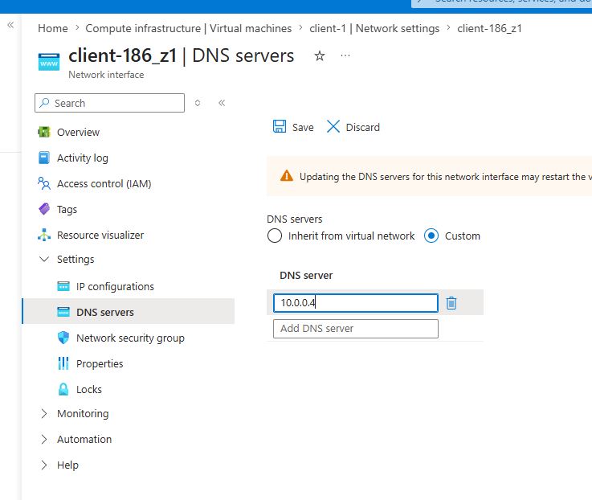

  
- What was done:
Configured the client machine to use the Domain Controller's private IP address as its primary DNS server.
  
- Why it matters:
Active Directory relies heavily on DNS to locate domain resources and services. Without proper DNS configuration, domain joins and authentication will fail.

 

**Step 7: Restart Client-1**

  
- What was done:
Restarted the Client-1 virtual machine through the Azure Portal after completing network and Domain Controller configuration changes.
  
- Why it matters:
Restarting the client ensures that any recent network configuration changes, such as DNS settings or connectivity updates, are fully applied. This helps guarantee that the client machine can properly communicate with the Domain Controller and accurately recognize Active Directory services before proceeding with domain-related tasks.

 

**Step 8: Verify Network Connectivity**

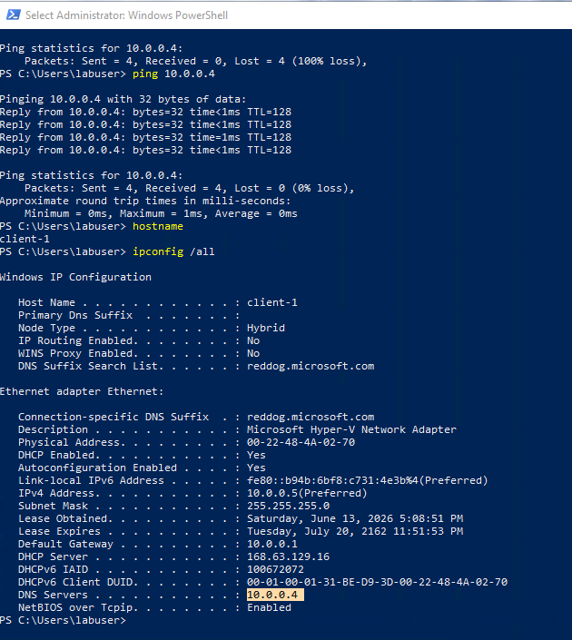

  
- What was done:
Used Remote Desktop and network testing tools to confirm communication between the client and server machines.

- Why it matters:
Verifying connectivity ensures that domain services, DNS resolution, and authentication requests can successfully travel across the network.

 

**Step 9: Install Active Directory**

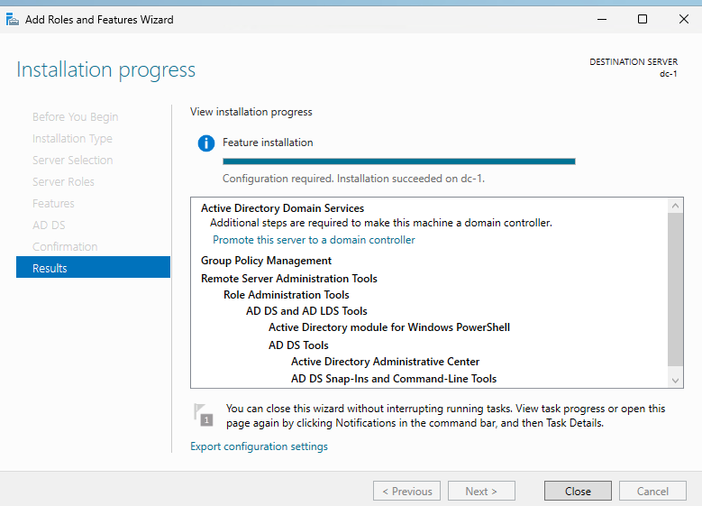

  
- What was done:
Installed the Active Directory Domain Services (AD DS) server role on the Windows Server virtual machine.
  
- Why it matters:
AD DS provides the framework for centralized identity management, enabling administrators to manage users, computers, groups, and security policies.

 

**Step 10: Promote the Server to a Domain Controller**

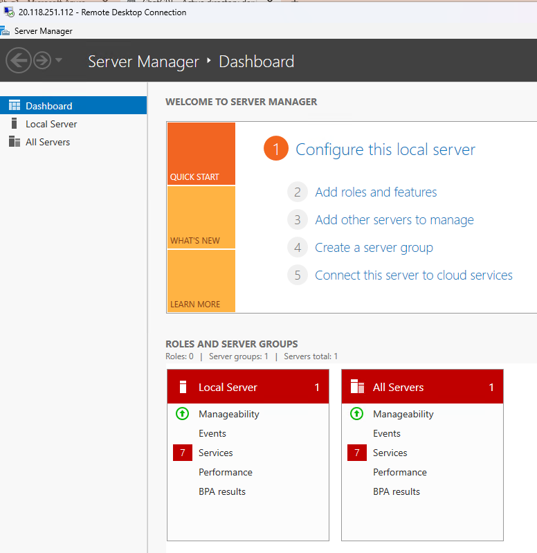

  
- What was done:
Promoted the server to a Domain Controller and created a new Active Directory forest and domain.
  
- Why it matters:
This step establishes the foundation of the organization's identity infrastructure and allows devices and users to authenticate against a centralized directory

 

**Step 11: Create Organizational Units (OUs) AND Create a domain Admin user (jane) within the domain (mydomain.com)**

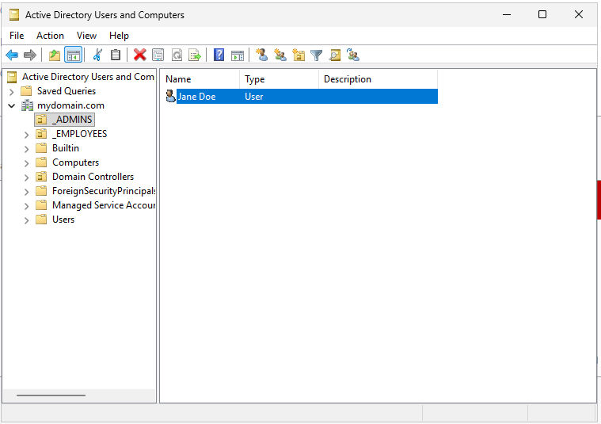

  
- What was done:
Created Organizational Units within Active Directory to logically organize users, computers, and administrative resources. Created a new user account within Active Directory and assigned it to the Domain Admins security group, granting the account administrative privileges across the domain.

- Why it matters:
OUs simplify management and allow administrators to apply permissions and Group Policies to specific groups of users or devices. Domain Administrator accounts are used to manage Active Directory resources such as users, computers, groups, and organizational units. Creating a dedicated administrative account follows best practices by separating administrative tasks from the default built-in administrator account and provides secure, centralized management of the domain environment.

 

**Step 12: Join Client-1 to the Domain**

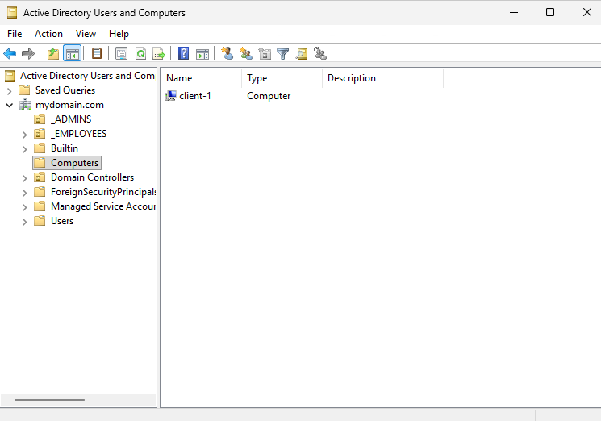

  
- What was done:
Added the Windows 10 client computer to the Active Directory domain and restarted the system.
  
- Why it matters:
Joining the domain enables centralized management of the workstation, including authentication, security policies, and administrative controls.

 

**Step 13: Set up remote desktop for non-administrative users on Client-1**

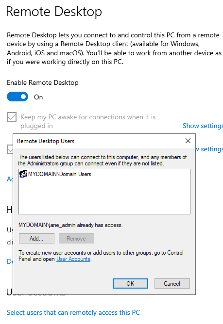

  
- What was done:
Configured the client machine to allow Remote Desktop access for authorized domain users.

- Why it matters:
Remote administration is a common requirement in enterprise environments and allows IT staff to support systems efficiently.

 

**Step 14: Generate 1000 Users with PowerShell and attempt to log into Client-1 with one of the users**

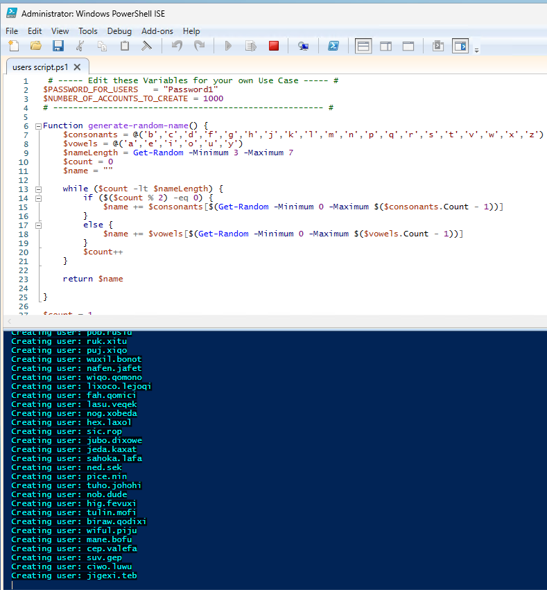

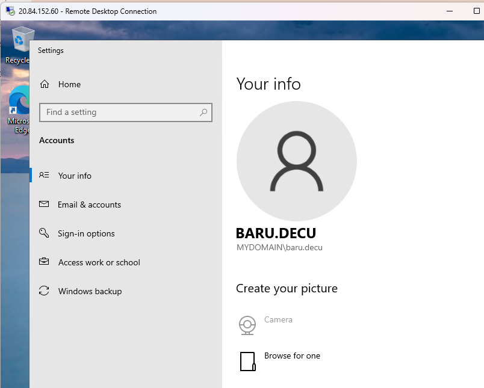

  
- What was done:
Used a PowerShell script to automatically create multiple Active Directory user accounts.
  
- Why it matters:
Automation reduces administrative effort, minimizes errors, and demonstrates practical scripting skills used by system administrators.

 

**Step 15: Dealing with accounts lockouts**

- Set account lockout policy in Active directory 

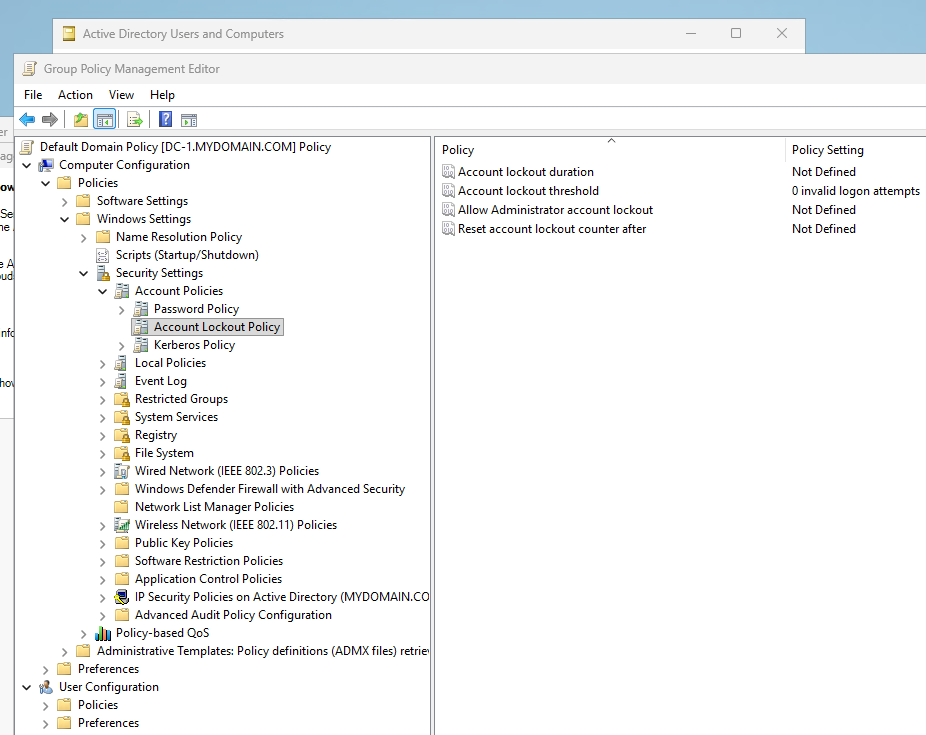

- Lock user account out (baru.decu)

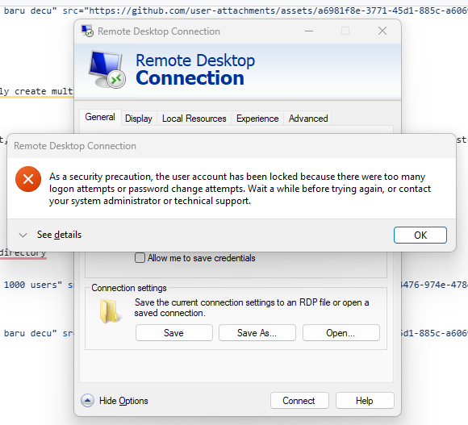

- Unlock user account (baru.decu)

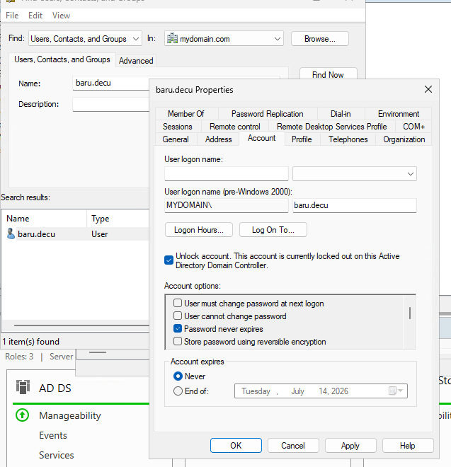

  

  
- What was done:
Simulated an account lockout by entering incorrect login credentials multiple times, then used Active Directory administrative tools to identify the locked account, unlock it, and restore user access.
  
- Why it matters:
Account lockouts are a common Help Desk and System Administration issue. Understanding how to identify, troubleshoot, and resolve locked accounts helps maintain user productivity while enforcing security policies that protect against unauthorized access attempts.

 

**Step 16: Enabling and Disabling User Accounts**

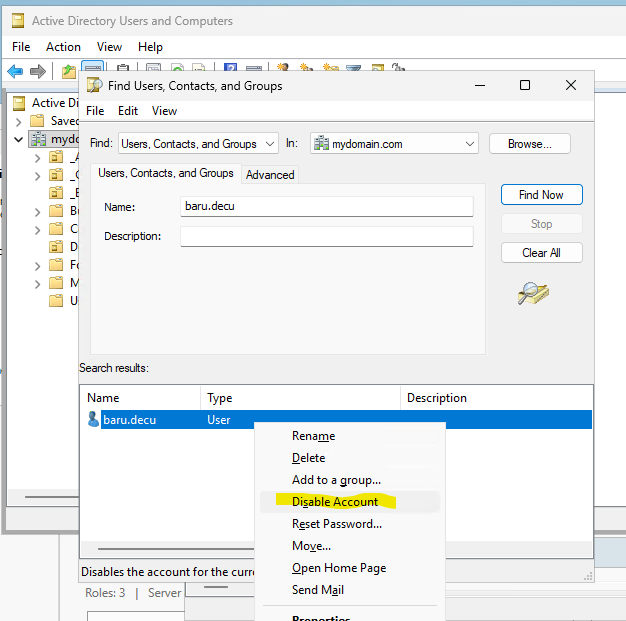

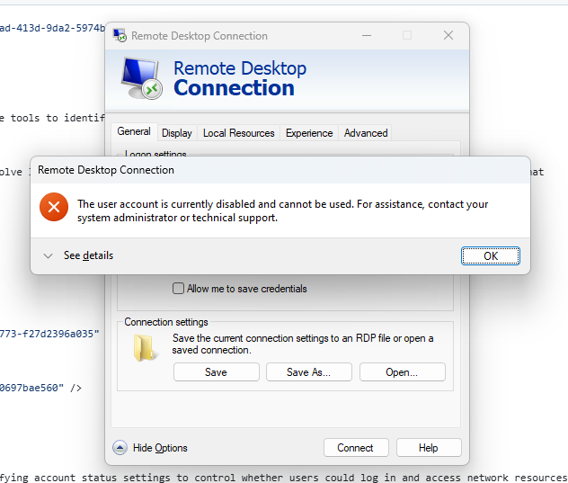

  
- What was done:
Used Active Directory Users and Computers (ADUC) to disable and re-enable user accounts within the domain. This involved modifying account status settings to control whether users could log in and access network resources.
  
- Why it matters:
Disabling accounts is a common security and administrative practice used when employees leave an organization, take extended leave, or when suspicious account activity is detected. Re-enabling accounts restores access when appropriate while maintaining centralized control over user authentication and permissions.

 

**Step 17:Observing Logs**

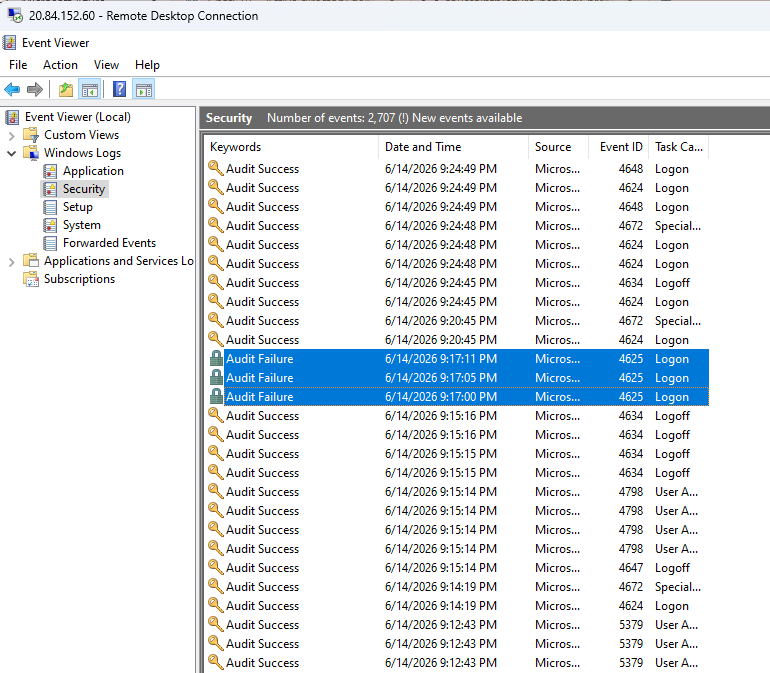

  
- What was done:
Reviewed system and security logs using Windows Event Viewer to monitor authentication events, account activity, and system-generated messages within the Active Directory environment.
  
- Why it matters:
Logs provide valuable information about user logins, account lockouts, system errors, and security events. Monitoring logs helps administrators troubleshoot issues, investigate security incidents, and verify that Active Directory services are operating correctly.

 

<h2>Final Result</h2>

- Successfully deployed an on-premises Active Directory environment within Microsoft Azure by creating a Windows Server 2022 Domain Controller and a Windows 10 client workstation. Active Directory Domain Services (AD DS) and DNS were configured to provide centralized authentication, user management, and name resolution services across the environment.

- The client computer was successfully joined to the domain, allowing users to authenticate using domain credentials. Administrative tasks such as creating a Domain Administrator account, managing user accounts, enabling and disabling accounts, troubleshooting account lockouts, and reviewing security and system logs were completed to simulate real-world IT support and system administration responsibilities.

- The completed environment demonstrates foundational skills in cloud infrastructure deployment, Windows Server administration, Active Directory management, DNS configuration, user lifecycle management, authentication troubleshooting, and enterprise identity and access management.

<h2>Skills Demonstrated</h2>

- Microsoft Azure Virtual Machine Deployment
- Azure Virtual Networking
- Windows Server 2025 Administration
- Active Directory Domain Services (AD DS)
- Domain Controller Installation and Configuration
- Active Directory Forest and Domain Creation
- DNS Configuration and Troubleshooting
- Active Directory Users and Computers (ADUC)
- Organizational Unit (OU) Management
- Domain User Account Administration
- Domain Administrator Account Creation
- User Lifecycle Management
- Account Enablement and Disablement
- Account Lockout Troubleshooting
- Windows Event Viewer Log Analysis
- Authentication and Authorization Management
- Identity and Access Management (IAM) Fundamentals
- Remote Desktop Administration
- Network Connectivity Testing
- Windows Security Administration
- Troubleshooting and Root Cause Analysis
- PowerShell Fundamentals
- IT Infrastructure Documentation
- Enterprise Environment Administration
